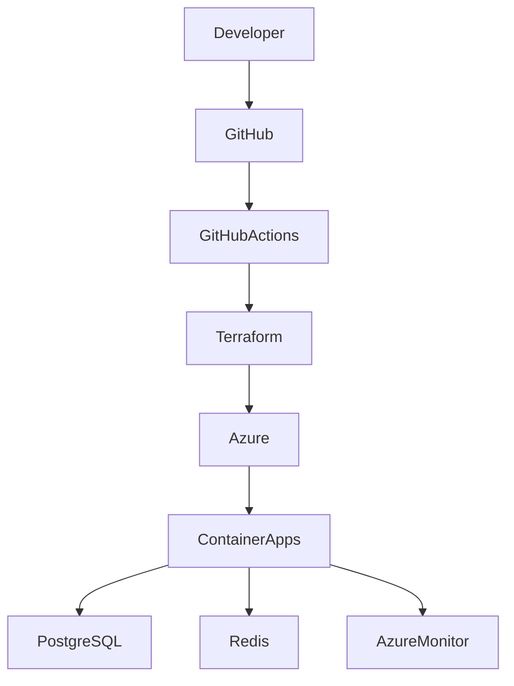

<div align="center">

# Atlas Platform

### Building the next generation of Platform Engineering on Azure and AWS

Created by **Dakota Bazan** & **Enzo Notario**

[]()
[]()
[]()
[]()
[]()
[]()
[]()

</div>

---

## Overview

Atlas Platform is a modern Platform Engineering initiative focused on delivering a production-oriented reference architecture for cloud-native applications.

The project combines modern Software Engineering and Cloud Platform Engineering practices to demonstrate how applications can be developed, deployed, operated and scaled using enterprise-grade workflows.

Atlas Platform is designed around the principles adopted by modern engineering organizations operating on Microsoft Azure, AWS and cloud-native ecosystems.

---

## Vision

Modern software teams should focus on building products.

Infrastructure, deployment workflows, governance, observability and developer experience should be automated, reproducible and scalable.

Atlas Platform aims to provide a practical implementation of that vision.

---

## Core Principles

- Infrastructure as Code
- Platform Engineering
- Cloud Native Architecture
- Developer Experience
- Continuous Delivery
- Automation First
- Security by Design
- Observability
- Reusability
- Scalability

---

## Architecture

```text
Developer
    │
    ▼
GitHub
    │
    ▼
GitHub Actions
    │
    ▼
Terraform
    │
    ▼
Azure / AWS
    │
    ▼
Container Platform
    │
    ▼
Application Services
    │
    ├── PostgreSQL
    ├── Redis
    ├── Monitoring
    └── Logging
```

---

## Technology Stack

### Software Engineering

- Node.js
- TypeScript
- NestJS
- PostgreSQL
- Redis
- OpenAPI

### Cloud Engineering

- Microsoft Azure
- AWS
- Terraform
- Docker
- GitHub Actions
- Container Registry
- DNS
- Networking

### Operations

- Monitoring
- Logging
- Health Checks
- CI/CD
- Cloud Governance

---

## Contributors

### Dakota Bazan

Cloud Engineering • DevOps • Platform Engineering

Focused on Infrastructure as Code, cloud automation, Azure architecture and developer platform enablement.

### Enzo Notario

Software Engineering • Backend Architecture • Open Source

Focused on scalable applications, APIs, developer tools and modern software architecture.

---

## Project Goals

### Phase 1

- Backend Reference Service
- PostgreSQL Integration
- Redis Integration
- Docker Environment
- API Documentation

### Phase 2

- Terraform Infrastructure
- Azure Deployment
- GitHub Actions
- Container Registry

### Phase 3

- Monitoring
- Observability
- Cloud Governance
- Production Workflows

---

## Why Atlas Platform

Atlas Platform is more than a sample application.

It is a public engineering initiative created to demonstrate how modern Software Engineering and Platform Engineering disciplines can converge into a unified cloud-native delivery model.

---

## Repository Roadmap

- [ ] Reference Backend Service
- [ ] Infrastructure as Code Modules
- [ ] CI/CD Pipelines
- [ ] Azure Deployment
- [ ] Monitoring Stack
- [ ] Documentation Portal
- [ ] Reference Architecture v1

---

## Platform Architecture


---

Building the next generation of Platform Engineering on Azure and AWS.

</div>
